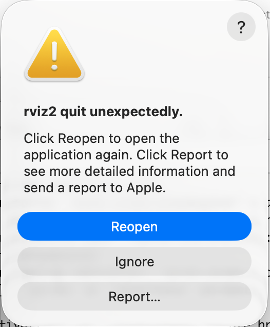

# WASP Autonomous Systems Course

## Supported platforms 
* Linux: Tested on x86-64 with Ubuntu 24.04.
* Mac: Tested on AArch64 system with macOS 26.6.2 (chip Apple M4 Pro).
* Windows: Net yet tested

## Core components used 
* [Pixi](https://pixi.prefix.dev/latest/): A cross-platform package management system that allows us to run ROS2 Jazzy in a Ubuntu 24.04 in the same way on Mac, Linux and Windows.
* [Webots](https://cyberbotics.com): A simulator with a physics engine. If it was not for our Mac users we could have done it all with Pixi using the Gazebo simulator but there is a bug that makes it impossible to simulate camera like sensors which we need.
* Matlab: Used in one task in a mandatory assignment and two conditionally elective assignments. Available from your university.
  
## Installation
### macOS -------------------------- 

#### Install Pixi 
You find full instructions [here](https://pixi.prefix.dev/latest/installation/).
Run the following in a terminal
```
curl -fsSL https://pixi.sh/install.sh | sh
```
You might want to set up [autocomplete](https://pixi.prefix.dev/latest/installation/#autocompletion) smoother operation of Pixi.

#### Install Webots R2025a 
Run the following in a terminal
```
curl -L -O https://github.com/cyberbotics/webots/releases/download/R2025a/webots-R2025a.dmg
open webots-R2025a.dmg
```

### Linux -------------------------- 

#### Install Pixi 
You find full instructions [here](https://pixi.prefix.dev/latest/installation/).
Run the following in a terminal
```
curl -fsSL https://pixi.sh/install.sh | sh
```
You might want to set up [autocomplete](https://pixi.prefix.dev/latest/installation/#autocompletion) smoother operation of Pixi.

#### Install Webots R2025a 
```
curl -L -O https://github.com/cyberbotics/webots/releases/download/R2025a/webots_2025a_amd64.deb
sudo apt install ./webots_2025a_amd64.deb
```
Do not worry if you see the message:
```
N: Download is performed unsandboxed as root file 
'<SOMETHING>/webots_2025a_amd64.deb' couldn't be 
accessed by user '_apt'. - pkgAcquire::Run
(13: Permission denied)
```
that is expected.


### Windows -------------------------- 
#### Install Pixi
Download [installer](https://github.com/prefix-dev/pixi/releases/latest/download/pixi-x86_64-pc-windows-msvc.msi)
or run:
```
powershell -ExecutionPolicy Bypass -c "irm -useb https://pixi.sh/install.ps1 | iex"
```


#### Install Webots R2025a 
Run the commands in a terminal:
```
curl.exe -L -O https://github.com/cyberbotics/webots/releases/download/R2025a/webots-R2025a_setup.exe
start webots-R2025a_setup.exe
```
and follow the guided procedure.

## Installing the course specific code
Open a terminal and move to where you want to work. 

**NOTE:** Make sure to not work in a directory managed by Google Drive, iCloud, Dropbox or some other cloud service. There are somewhere between half a million and one million files created by Pixi to setup large parts of a Ubuntu 24.04 systems. Synching these files will be problematic for the network and your computer will spent a lot of efforts trying to keep everything up to date.

Run the following to download the course code
```
git clone https://github.com/KTH-RPL/wasp_autonomous_systems.git
```
Build the software (this will take some time) and download two files with data to use.
```
cd wasp_autonomous_systems
pixi run build
pixi run download_rosbags
```


## Known issues on macOS
- Closing RViz reliably triggers macOS's crash reporter:

  

  This is a known upstream ROS2 issue, not caused by anything in this
  repo: `pluginlib`'s `class_loader` crashes (`abort()` via
  `class_loader::ClassLoader::~ClassLoader()`) during shared-library
  teardown at process exit, a shutdown-ordering bug that's worse on
  macOS than Linux. It happens *after* RViz has already done everything
  it was asked to do - purely cosmetic, nothing is lost. Click **Ignore**
  and move on.
